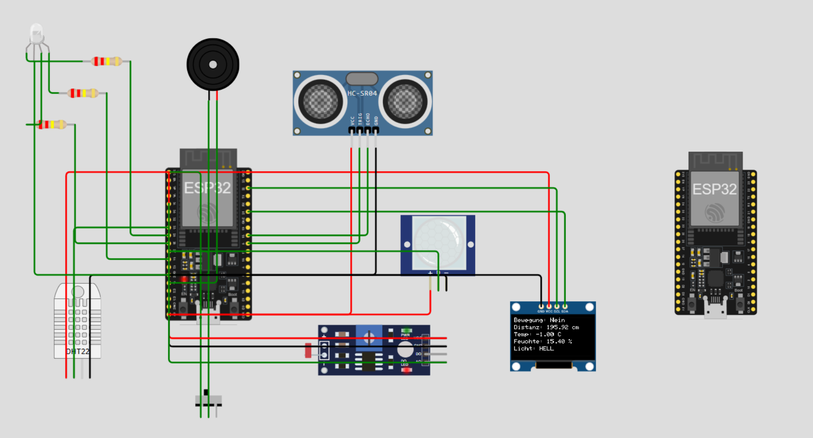

# ESP32 IoT-Station mit ESP-NOW

**SYT ITP Projekt – ESP32 IoT Station mit Webserver, WiFi-Manager und Sleep-Mode**

Gruppenmitglieder: Lena Zangerl, Damjan Panevski

Datum: 25.05.2026

---

## 1. Einführung
Im Rahmen dieses Projekts wurde ein IoT-System mit zwei ESP32-Mikrocontrollern umgesetzt. Ziel war es, Sensordaten drahtlos über ESP-NOW zu übertragen und auf einem zweiten ESP32 übersichtlich darzustellen.

Der erste ESP32 dient als Sender und erfasst verschiedene Umgebungsdaten wie Distanz, Temperatur, Luftfeuchtigkeit, Bewegung, Neigung und Helligkeit. Die Messwerte werden direkt auf einem OLED-Display angezeigt und zusätzlich per ESP-NOW an den zweiten ESP32 übertragen.

Der zweite ESP32 arbeitet als Empfänger. Er nimmt die Sensordaten entgegen, stellt ein Webinterface 

---

## 2. Projektbeschreibung

Das System besteht aus einem Sender-ESP32 und einem Empfänger-ESP32. Der Sender liest die angeschlossenen Sensoren aus und sendet die Messdaten regelmäßig über ESP-NOW an den Empfänger. Während der Messphase werden aktuelle Werte laufend übertragen und am OLED-Display dargestellt.

Nach einer Messdauer von 30 Sekunden bildet der Sender Durchschnittswerte aus den aufgenommenen Messungen. Anschließend wechselt er für 30 Sekunden in einen Sleep-/Pausenmodus. In dieser Zeit werden keine neuen Sensordaten aufgenommen, stattdessen werden die zuletzt berechneten Durchschnittswerte angezeigt und übertragen.

Der Empfänger bleibt dauerhaft aktiv. Er empfängt die Datenpakete des Senders und stellt sie über einen eigenen Webserver zur Verfügung. Über die IP-Adresse des Empfängers kann ein Webinterface geöffnet werden, auf dem die aktuellen Messwerte angezeigt werden. Zusätzlich werden historische Durchschnittswerte gespeichert, ohne jede einzelne Messung dauerhaft abzulegen.

Zur besseren Auswertung werden die historischen Daten im Webinterface als einfacher Graph dargestellt. Außerdem stellt der Empfänger eine JSON-API bereit, über die die aktuellen Sensordaten maschinenlesbar abgerufen werden können. Als Zusatzfunktion wurde ein Telegram-Bot eingebunden, der auf Anfrage den aktuellen Status des Systems zurückmeldet.

---

## 3. Projektziel

Ziel dieses Projekts ist die Umsetzung eines IoT-Systems mit zwei ESP32-Mikrocontrollern. Sensordaten sollen auf einem ESP32 erfasst und anschließend drahtlos über ESP-NOW an einen zweiten ESP32 übertragen werden.

Der zweite ESP32 soll die empfangenen Daten über ein Webinterface visualisieren. Zusätzlich sollen historische Durchschnittswerte in einem einfachen Graphen dargestellt werden. Der Sender soll außerdem einen Mess- und Pausenmodus verwenden, um nicht dauerhaft Messungen durchzuführen.

---

## 4. Arbeitsschritte

1. Auswahl und Anschluss der Sensoren am Sender-ESP32
2. Einrichten des OLED-Displays zur Anzeige der aktuellen Messwerte
3. Implementierung der Sensordatenerfassung am Sender
4. Bildung von Durchschnittswerten über eine Messphase von 30 Sekunden
5. Umsetzung eines Sleep-/Pausenmodus nach jeder Messphase
6. Einrichtung der ESP-NOW-Kommunikation zwischen Sender und Empfänger
7. Implementierung des Empfängers zur Verarbeitung der Datenpakete
8. Erstellung eines Webservers auf dem Empfänger-ESP32
9. Gestaltung eines einfachen Webinterfaces zur Anzeige der aktuellen Messwerte
10. Speicherung historischer Durchschnittswerte im Arbeitsspeicher
11. Darstellung der historischen Daten in einem einfachen Graphen
12. Bereitstellung einer JSON-API für die aktuellen Sensordaten
13. Integration eines Telegram-Bots zur Statusabfrage
14. Testen der Kommunikation, Anzeige und Bot-Funktion

---

## 4.1 Verwendete Komponenten

### Software

**Libraries:**

- **WiFi.h**  
  Wird verwendet, um den ESP32 mit einem WLAN zu verbinden und den Access Point für das Webinterface bereitzustellen.

- **WiFiClientSecure.h**  
  Ermöglicht verschlüsselte HTTPS-Verbindungen. Diese Library wird für die Kommunikation mit der Telegram-API benötigt.

- **WiFiManager.h**  
  Stellt eine Konfigurationsseite bereit, über die WLAN-Zugangsdaten eingegeben werden können, ohne sie fest im Code einzutragen.

- **esp_now.h**  
  Wird für die ESP-NOW-Kommunikation zwischen Sender-ESP32 und Empfänger-ESP32 verwendet.

- **esp_wifi.h**  
  Ermöglicht erweiterte WLAN-Einstellungen wie das Setzen bzw. Auslesen des WLAN-Kanals für ESP-NOW.

- **WebServer.h**  
  Wird genutzt, um auf dem Empfänger-ESP32 einen Webserver zu starten und das Webinterface sowie die JSON-API bereitzustellen.

- **UniversalTelegramBot.h**  
  Ermöglicht die Kommunikation mit dem Telegram-Bot, z. B. für den Befehl `/status`.

- **ArduinoJson.h**  
  Wird von der Telegram-Bot-Library benötigt und kann außerdem zur Verarbeitung von JSON-Daten verwendet werden.

### Hardware
**Sender-ESP32**

| Komponente                 | Anzahl | Funktion |
|---------------------------|:------:|----------|
| ESP32 Dev Board           | 1      | Steuerung, Messung und ESP-NOW-Senden |
| DHT11 Sensor              | 1      | Temperatur und Luftfeuchtigkeit |
| HC-SR04 Ultraschallsensor | 1      | Abstandsmessung |
| PIR Bewegungssensor       | 1      | Bewegungserkennung |
| LDR                       | 1      | Helligkeitsmessung |
| Tilt B15 Sensor           | 1      | Neigungserkennung |
| OLED Display 128x64       | 1      | Anzeige der Messwerte |
| RGB LED                   | 1      | Optische Statusanzeige |
| Buzzer                    | 1      | Akustisches Signal |
| Breadboard                | 1      | Schaltungsaufbau |
| Jumper Kabel              | mehrere| Verbindungen |
| USB Kabel                 | 1      | Stromversorgung und Programmierung |

**Empfänger-ESP32**

| Komponente        | Anzahl | Funktion |
|------------------|:------:|----------|
| ESP32 Dev Board  | 1      | ESP-NOW-Empfang, Webserver und Telegram-Bot |
| USB Kabel        | 1      | Stromversorgung und Programmierung |

---

## 4.2 Bauteile Verbinden

### Sensoren 

**Neigungssensor (Tilt B15)**  

VCC -> 5V  

GND -> GND  

OUT -> GPIO 32  

Der Tilt-Sensor benötigt einen digitalen Eingang. Je nach Modul kann ein Pullup- oder Pulldown-Widerstand nötig sein. GPIO 32 ist dafür geeignet.  

**Helligkeitssensor (LDR)**  

VCC -> 3.3V  

GND -> GND  

DO -> GPIO 34  

Ein LDR wird über einen Spannungsteiler an einem analogen Eingang gemessen. Geeignet sind z. B. GPIO 34, 35, 36 oder 39. Diese Pins sind nur Eingänge und daher gut für Sensoren geeignet  

**Temperatur- und Luftfeuchtigkeitssensor (DHT11)**  

VCC -> 3.3V  

GND -> GND  

SIGNAL -> GPIO 33  

Der DHT11 benötigt einen digitalen GPIO als Datenleitung. Geeignet sind z. B. GPIO 33, 32, 25, 26 oder 27. Der Sensor sollte nicht zu schnell ausgelesen werden.  

**Bewegungssensor (PIR)**  

VCC -> 5V  

GND -> GND  

OUT -> GPIO 2  

Der PIR-Sensor benötigt einen digitalen Eingang. GPIO 2 kann beim Starten des ESP32 problematisch sein, weil er ein Boot-Pin ist. Besser sind z. B. GPIO 14, 16, 17, 19 oder 23.  

**Ultraschallsensor (HC-SR04)**  

VCC -> 5V  

GND -> GND  

TRIG -> GPIO 5  

ECHO -> GPIO 18  

Der Sensor benötigt zwei digitale Pins: TRIG als Ausgang und ECHO als Eingang. Wichtig: Der ECHO-Pin kann 5 V ausgeben, der ESP32 verträgt aber nur 3,3 V. Deshalb sollte ein Spannungsteiler verwendet werden.  

### Aktoren  

**Mehrfarbige LED (RGB LED)**  

Kathode -> GND  

ROT (Anode) -> 3.3V GPIO 25  

GRÜN (Anode) -> 3.3V GPIO 26  

BLAU (Anode) -> 3.3V GPIO 27  

Eine RGB-LED benötigt drei PWM-fähige Ausgänge, einen für Rot, Grün und Blau. Im Projekt werden GPIO 25, 26 und 27 verwendet. Für jede Farbe sollte ein Vorwiderstand verwendet werden. Zusätzlich braucht man für alle kurzen Beine einrn 220 OHM Wiederstand, welcher seriell angehängt wird.  

**Buzzer**  

VCC -> 3.3V GPIO 13  

GND -> GND  

Der Buzzer benötigt einen digitalen Ausgang. Für Töne mit tone() eignet sich ein normaler GPIO, z. B. GPIO 13. Bei  
größeren Buzzern sollte ein Transistor verwendet werden.  

**OLED Display**  

VCC -> 3.3V  

GND -> GND  

SCL -> GPIO 22  

SDA -> GPIO 21  

Das Display wird über I2C angeschlossen. Beim ESP32 werden häufig GPIO 21 als SDA und GPIO 22 als SCL verwendet. Die I2C-Adresse ist meistens 0x3C.  

### Hinweiß  

Alle GND-Anschlüsse der Sensoren, Aktoren und des ESP32 müssen miteinander verbunden sein.

---

## 4.3 Code hochladen / testen

Nach dem Aufbau der Schaltung wird der Programmcode auf beide ESP32 hochgeladen. Zuerst sollte der Empfänger gestartet werden, damit im seriellen Monitor die MAC-Adresse und der verwendete WLAN-Kanal angezeigt werden. Diese Werte müssen anschließend im Sender-Code eingetragen werden.

Wichtig ist ebenfalls zu beachten das der Empfänger ESP32 erst Wlan hat, wenn man sich einmal mit ihm verbindet, wenn nicht geändert Passwort: 12345678 und Name: ESP32-Empfaenger. Dann öffnet sich eine Konfigurationsseite, auf der man einmal den ESP32 mit den WLAN Daten (Name, Passwort) seines Wlans zuhause verbiden muss. 

Danach wird der Sender gestartet. Im seriellen Monitor kann überprüft werden, ob die ESP-NOW-Pakete erfolgreich gesendet werden. Beim Empfänger sollte sichtbar sein, dass regelmäßig neue Datenpakete ankommen. Erst wenn diese Kommunikation funktioniert, werden Webinterface, Graph und Telegram-Bot getestet.

Zum Testen wird das Webinterface des Empfängers geöffnet und kontrolliert, ob sich die Sensorwerte bei Änderungen am Aufbau aktualisieren. Anschließend wird geprüft, ob der Sleep-/Pausenmodus korrekt zwischen Messphase und Pause wechselt und ob der Graph nach einigen Messzyklen historische Durchschnittswerte anzeigt. Zum Schluss kann der Telegram-Bot mit dem Befehl /status getestet werden.

---

## 5. Umgesetzte Funktionen

### GK (Grundkompetenzen)

- **ESP-NOW-Kommunikation:** Drahtlose Übertragung der Sensordaten zwischen zwei ESP32-Mikrocontrollern
- **Webserver:** Der Empfänger stellt ein Webinterface über seine IP-Adresse bereit
- **Webinterface:** Anzeige der aktuellen Messwerte in einer übersichtlichen Webseite
- **Sleep-/Pausenmodus:** Der Sender misst 30 Sekunden lang und pausiert anschließend 30 Sekunden
- **Helligkeitssensor (LDR):** Erfassung der Umgebungshelligkeit und Einteilung in hell oder dunkel
- **Tilt-Sensor:** Erkennung einer Neigung bzw. Lageänderung des Geräts
- **OLED-Display:** Anzeige der aktuellen Werte und des aktuellen Zustands direkt am Sender

### EK (Erweiterte Kompetenzen)

- **PIR-Bewegungssensor:** Erkennt Bewegungen im Raum und löst bei Bewegung den Buzzer aus
- **Ultraschallsensor HC-SR04:** Misst die Entfernung zu Objekten in Zentimetern
- **DHT11-Sensor:** Misst Temperatur und Luftfeuchtigkeit
- **RGB-LED:** Visualisiert die Distanz durch verschiedene Farben, z. B. grün, orange und rot
- **Buzzer:** Gibt ein akustisches Signal aus, sobald Bewegung erkannt wird
- **OLED-Display** Zeigt die gemessenen Werte an.
- **Telegram-Bot:** Abfrage des aktuellen Sensorstatus über Telegram mit `/status`
- **einfacher Graph / Mittelwertbildung:** Berechnung von Durchschnittswerten aus den Messdaten einer Messphase und darstellung historischer Durchschnittswerte im Webinterface

---


## 6. Funktionshinweise

Der Sender-ESP32 erfasst die Sensordaten und zeigt sie direkt am OLED-Display an. Zusätzlich sendet er die Werte per ESP-NOW an den Empfänger-ESP32.

Der Buzzer wird aktiviert, sobald der PIR-Sensor eine Bewegung erkennt. Dadurch wird eine erkannte Bewegung nicht nur im Display und Webinterface angezeigt, sondern auch akustisch signalisiert.

Die RGB-LED visualisiert die gemessene Distanz des Ultraschallsensors:

- **Grün:** Objekt ist weit entfernt
- **Orange/Gelb:** Objekt befindet sich in mittlerer Entfernung
- **Rot:** Objekt ist sehr nah

Der Sender arbeitet in einem Mess- und Pausenzyklus. Während der Messphase werden aktuelle Werte aufgenommen und angezeigt. Nach 30 Sekunden werden Durchschnittswerte berechnet. In der anschließenden Pausenphase werden keine neuen Messwerte aufgenommen, sondern die zuletzt berechneten Durchschnittswerte angezeigt und übertragen.

Der Empfänger-ESP32 bleibt dauerhaft aktiv. Er empfängt die Daten, stellt sie im Webinterface dar und beantwortet Telegram-Anfragen wie `/status`.

---

## 7. Sleep-Mode-Protokoll

Der Sender-ESP32 arbeitet in einem festen Mess- und Pausenzyklus. Ziel ist es, nicht dauerhaft neue Sensordaten aufzunehmen, sondern Messphasen und Ruhephasen klar voneinander zu trennen.

Der Empfänger-ESP32 bleibt dauerhaft aktiv. Dadurch kann er jederzeit ESP-NOW-Daten empfangen und das Webinterface sowie den Telegram-Bot bereitstellen. Es geht also keine Messung verloren, da nur der Sender in den Pausenmodus wechselt.

Ablauf des Zyklus:

Messphase: 30 Sekunden
Der Sender liest alle Sensoren aus und zeigt die aktuellen Werte am OLED-Display an. Zusätzlich werden Live-Werte per ESP-NOW an den Empfänger gesendet.

Mittelwertbildung
Nach Ablauf der 30 Sekunden berechnet der Sender Durchschnittswerte aus den aufgenommenen Messungen. Diese Durchschnittswerte werden an den Empfänger gesendet und für den Graphen verwendet.

Pausenphase: 30 Sekunden
Während der Pause werden keine neuen Sensordaten aufgenommen. Der Buzzer, die RGB-LED und der Ultraschall-Trigger werden deaktiviert. Am OLED-Display werden die zuletzt berechneten Durchschnittswerte und ein Countdown angezeigt.

Wiederaufnahme der Messung
Nach Ablauf der Pausenphase startet automatisch eine neue Messphase. Die alten Messwerte werden zurückgesetzt und neue Sensordaten werden aufgenommen.

Synchronisation:

Der Empfänger muss nicht schlafen, sondern bleibt durchgehend aktiv. Dadurch kann er sowohl Live-Werte während der Messphase als auch Durchschnittswerte und Statusdaten während der Pausenphase empfangen. Der Sender überträgt zusätzlich den aktuellen Zustand (Awake oder Sleep) und die verbleibenden Sekunden bis zum nächsten Wechsel. Dadurch kann der Empfänger den Zustand korrekt im Webinterface anzeigen.

Zeitplan:

0 bis 30 Sekunden: Messphase (Awake)
bei 30 Sekunden: Durchschnittswerte werden berechnet und gesendet
30 bis 60 Sekunden: Pausenphase (Sleep)
bei 60 Sekunden: neue Messphase beginnt
Hinweis:

Im Projekt wird ein softwarebasierter Sleep-/Pausenmodus verwendet. Der ESP32 wird dabei nicht vollständig in den Deep-Sleep versetzt, damit OLED-Anzeige, Countdown und ESP-NOW-Statusübertragung weiterhin funktionieren. Die Messungen werden während der Pausenphase gestoppt, wodurch der Energieverbrauch gegenüber dauerhaftem Messen reduziert wird.

---

## 8. Schaltungsplan

Der Schaltungsplan zeigt den Aufbau des Projekts mit dem Sender-ESP32 und den angeschlossenen Sensoren bzw. Aktoren. Dargestellt sind die Verbindungen zum DHT11-Sensor, Ultraschallsensor, PIR-Sensor, LDR, Tilt-Sensor, OLED-Display, RGB-LED und Buzzer.



---
## 9. Code

### Sender Code

Der Sender-Code befindet sich in der Datei:

```text
Code/Sender/SenderCode.ino
```

### Empfänger Code

Der Empfänger-Code befindet sich in der Datei:

```text
Code/Empfaenger/EmpfaengerCode.ino
```

## 10. Quellen

- ESP32 with DHT11/DHT22 Temperature and Humidity Sensor: https://randomnerdtutorials.com/esp32-dht11-dht22-temperature-humidity-sensor-arduino-ide/
  
- Ultraschallsensor Erklärung: https://components101.com/sensors/ultrasonic-sensor-working-pinout-datasheet
  
- Bewegungssensor Funktionsweise: https://lastminuteengineers.com/pir-sensor-arduino-tutorial/
  
- OLED Display (SSD1306) Infos: https://randomnerdtutorials.com/esp32-ssd1306-oled-display-arduino-ide/

